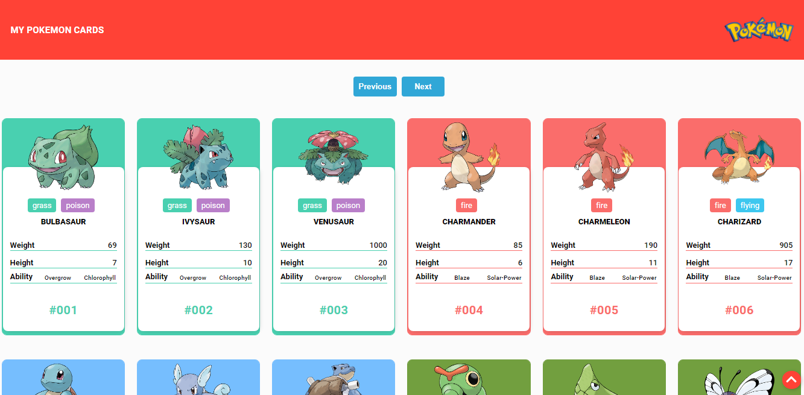

<h4 align="center">
	:construction: My Pokemon cards 2.0 🚀 In progress.. :construction:
</h4>
<p align="center">
  

  

  <a href="https://www.linkedin.com/in/fidelis27/">
    
  </a>

  <a href="https://github.com/fidelis27/PokemonCards/commits/master">
    
  </a>

  
   <a href="https://github.com/fidelis27/PokemonCards/stargazers">
    
  </a>
</p>

<p align="center">
  <a href="#-Pokemon">My Pokemon cards</a>&nbsp;&nbsp;&nbsp;|&nbsp;&nbsp;&nbsp;
  <a href="#-Technologies">Technologies</a>&nbsp;&nbsp;&nbsp;|&nbsp;&nbsp;&nbsp;
  <a href="#-how-to-use">How to use</a>&nbsp;&nbsp;&nbsp;|&nbsp;&nbsp;&nbsp;
  <a href="#-how-to-contribute">How to contribute</a>&nbsp;|

</p>

## Pokemon
### What's My pokemon cards?

Is an application developed in react that consumes the API of the site https://pokeapi.co/. Application lists all pokemon through pagination.

In the project, I used two APIs, a first to consume data and a second to consume images. in the first API the images had low resolution so looking for another solution.
they are :
https://pokeapi.co/
https://assets.pokemon.com/assets/cms2/img/pokedex/full/1.png`


<h1 align="center">
    
</h1>


## Technologies

This project was developed with the following technologies:

- [Node.js][nodejs]
- [React][reactjs]

## 💻 How to use
### Install APP In progress.. :construction:
```bash
# Clone this repository
$ git clone https://github.com/fidelis27/PokemonCards.git

# Go into the repository
$ cd PokemonCards

# Install dependencies
$ yarn install

# Run
$ yarn start
```


## 🤔 How to contribute

- Make a fork;
- Create a branck with your feature: `git checkout -b my-feature`;
- Commit changes: `git commit -m 'feat: My new feature'`;
- Make a push to your branch: `git push origin my-feature`.

After merging your receipt request to done, you can delete a branch from yours.


Made with ♥ by Thiago Fidelis :wave: [Get in touch!](https://www.linkedin.com/in/fidelis27/)

[nodejs]: https://nodejs.org/
[reactjs]: https://reactjs.org
[yarn]: https://yarnpkg.com/
[vs]: https://code.visualstudio.com/
[vceditconfig]: https://marketplace.visualstudio.com/items?itemName=EditorConfig.EditorConfig
[vceslint]: https://marketplace.visualstudio.com/items?itemName=dbaeumer.vscode-eslint
[prettier]: https://marketplace.visualstudio.com/items?itemName=esbenp.prettier-vscode
